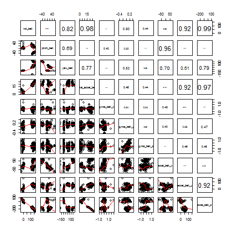
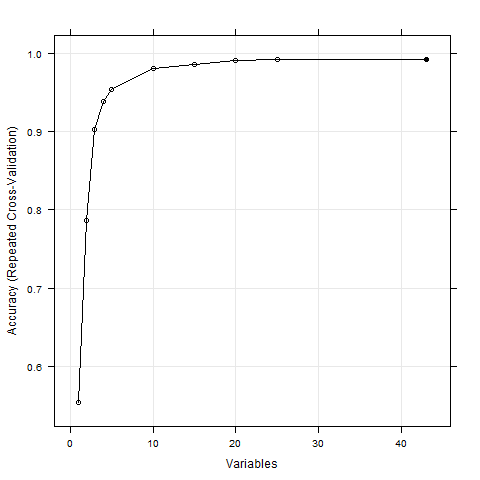

Practical Machine Learning
=========================== 
Course Project: Write Up

### Background & Objective

Research on activity recognition has traditionally focused on discriminating between different activities.  In this project, we try to predict the quality of executing an activity through data from accelerometers on the belt, forearm, arm, and dumbbell of 6 participants.


### Data
Six male participants were asked to perform barbell lifts correctly and incorrectly in 5 different ways. Three-axes acceleration, gyroscope and magnetometer data from the accelerometers attached to different locations were recorded. The data also contain other derived statistics, e.g. mean, variance, standard deviation, max, min, amplitude, kurtosis and skewness, of the signals. With the outcome variable, *classe*, and user identification, there are total 160 variables in the data.

The training data, 19622 observations, are available here: 
https://d396qusza40orc.cloudfront.net/predmachlearn/pml-training.csv

The test data, 20 observations, are available here: 
https://d396qusza40orc.cloudfront.net/predmachlearn/pml-testing.csv

### Analysis Summary

Without the codebook of the input data nor domain knowledge of the subject, I treated the features as they are, even though the data set probably should be separated into 2 data files: point-of-time versus aggregated level, b/c the derived features look like only populated when *new_windows = “yes”*, and might be derived from the same *window_num*. Only 6 out of 152 features in *new_windows = “yes”*  with NA rate more than 95% versus 100 out of 152 features with the same threshold in *new_windows = “no”*. Anyhow, in the analysis, I focused on the 152 numeric-formatted features and treated them as they are in the input data file, i.e. excluded “window”, and time-related features.

The write_up.R script (see file in the repo) was designed to do following:

* Step 0: Gave a quick check of data by separating them according to new vs. old windows. (The reason was explained as above.)
* Step 1: Cleaned up features with high missing/NA rate and those with single fixed value, i.e. variance = 0. Most of the derived features were removed in this step and left 51 features.
* Step 2: Further split *training* into two data sets: *Train* and *Test* with 70-30 split to detect overfitting.
* Step 3: Created a stratified sample to plot the features. Figure below shows 10 features out of 51. Several features were highly correlated with others. Either compressing the data or further feature selection is required. I didn't choose compressing data for easier explanation later.

 

* Step 4: 

   * Selected features through recursive feature eliminating. The *Train* data set were normalized first (unncessary step), and then correlation was checking again through findCorrelation in *caret* package. And, then through rfeControl func = rfFunctions to calculate variable importance using random forest. Figure below suggests ~15 features probably are sufficient to give us good accuracy.



```sh
> Top15.features
 [1] "yaw_belt"          "magnet_dumbbell_z" "pitch_forearm"     "magnet_dumbbell_y" 
 [5] "roll_forearm"      "magnet_dumbbell_x" "magnet_belt_y"     "magnet_belt_z"
 [9] "accel_dumbbell_y"  "roll_dumbbell"     "gyros_belt_z"      "roll_arm"     
[13] "total_accel_belt"  "accel_forearm_x"   "magnet_forearm_z" 
```
   * Used *randomForest* to train the selected features against *classe*. The in-sample error is ~1.3%.
   
 ```sh
> modFit.rf
        OOB estimate of  error rate: 1.27%
Confusion matrix:
     A    B    C    D    E class.error
A 3893    6    3    2    2 0.003328213
B   26 2597   30    5    0 0.022949586
C    0   33 2351   11    1 0.018781302
D    1    5   31 2211    4 0.018206039
E    0    1    7    7 2510 0.005940594

```
